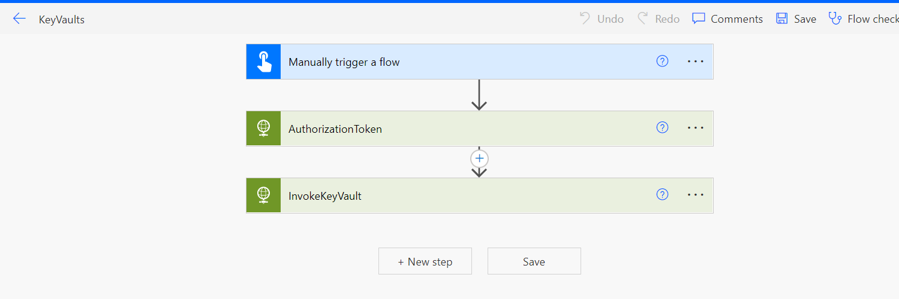
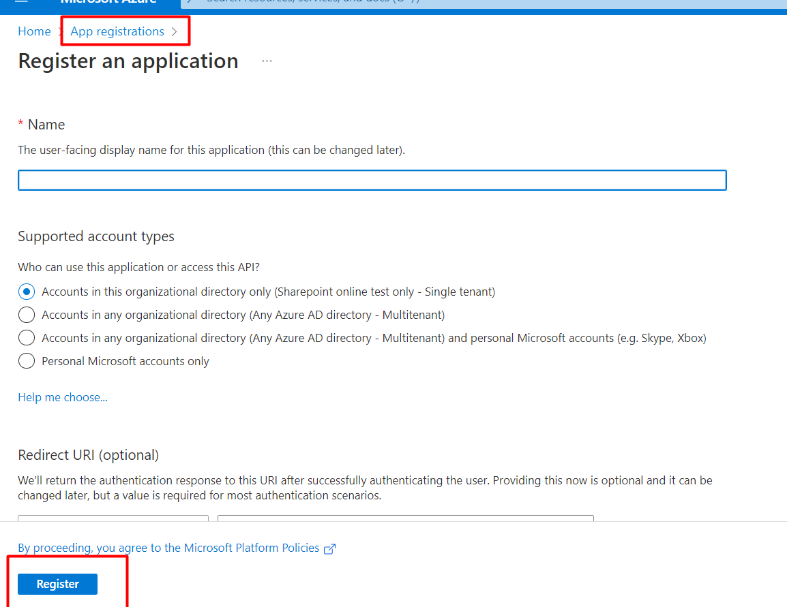
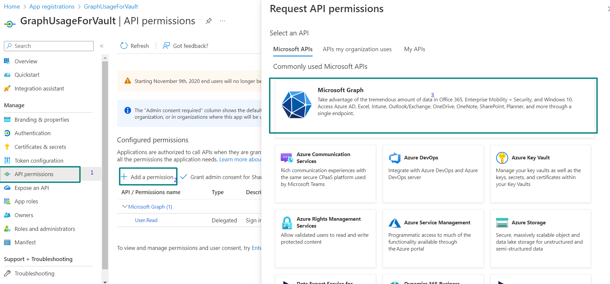

# Azure HTTP Key Vault

## Summary

A HTTP Request via Graph API to Azure Key Vault  

## Applies to

* [Microsoft Power Automate](https://docs.microsoft.com/en-us/power-automate/getting-started)
* [Azure Logic Apps](https://docs.microsoft.com/en-us/azure/logic-apps/logic-apps-overview)

## Compatibility

## Authors

Solution|Author(s)
--------|---------
azure-http-key-vault | [Divya Akula](https://github.com/divya-akula)

## Version history

Version|Date|Comments
-------|----|--------
1.0|Sep 18, 2022|Initial release

## Features

Azure Key vault helps us to securely store passwords ,Power Automate has an inbuilt connector that helps us to retrieve the passwords safely,  but when moving the flows across tenants , we might need to reconfigure the flow for appropriate credentials. To prevent this we can go with the graphapi invocation to azure using the HTTP connector.

This pattern also helps to understand the OAuth way of invoking a Azure or any other resource that supports OAuth.

Prerequisites:
As the app uses HTTP way to connect to Azure platform , the connector would need appropriate permissions to invoke an Azure Resource.To do this
1. User has to navigate to [Azure Portal](https://portal.azure.com)
2. Create new App registration as shown in the below screenshot

3. Once the application is registered,navigate to the **API Permissions** > **Add Permission** > **Select Microsoft Graph** > **APIConnectors.Read.All**

4. Once the permissions are requested , the administrator has to give the consent before using the HTTP connector

## Minimal Path to Awesome

* [Download](solution/HttpCallForKeyVault.zip) the `.zip` from the `solution` folder
* [Import](https://flow.microsoft.com/en-us/blog/import-export-bap-packages/) the `.zip` file using **My Flows** > **Import** > **Upload** within Microsoft Flow.

## Disclaimer

**THIS CODE IS PROVIDED *AS IS* WITHOUT WARRANTY OF ANY KIND, EITHER EXPRESS OR IMPLIED, INCLUDING ANY IMPLIED WARRANTIES OF FITNESS FOR A PARTICULAR PURPOSE, MERCHANTABILITY, OR NON-INFRINGEMENT.**

## Help

We do not support samples, but we this community is always willing to help, and we want to improve these samples. We use GitHub to track issues, which makes it easy for  community members to volunteer their time and help resolve issues.

If you encounter any issues while using this sample, [create a new issue](https://github.com/pnp/powerautomate-samples/issues/new?assignees=&labels=Needs%3A+Triage+%3Amag%3A%2Ctype%3Abug-suspected&template=bug-report.yml&sample=always-reply-to-request&authors=@remyblok&title=always-reply-to-request%20-%20).

For questions regarding this sample, [create a new question](https://github.com/pnp/powerautomate-samples/issues/new?assignees=&labels=Needs%3A+Triage+%3Amag%3A%2Ctype%3Abug-suspected&template=question.yml&sample=always-reply-to-request&authors=@remyblok&title=always-reply-to-request%20-%20).

Finally, if you have an idea for improvement, [make a suggestion](https://github.com/pnp/powerautomate-samples/issues/new?assignees=&labels=Needs%3A+Triage+%3Amag%3A%2Ctype%3Abug-suspected&template=suggestion.yml&sample=always-reply-to-request&authors=@remyblok&title=always-reply-to-request%20-%20).

## For more information

- [Create your first flow](https://docs.microsoft.com/en-us/power-automate/getting-started#create-your-first-flow)
- [Microsoft Power Automate documentation](https://docs.microsoft.com/en-us/power-automate/)

