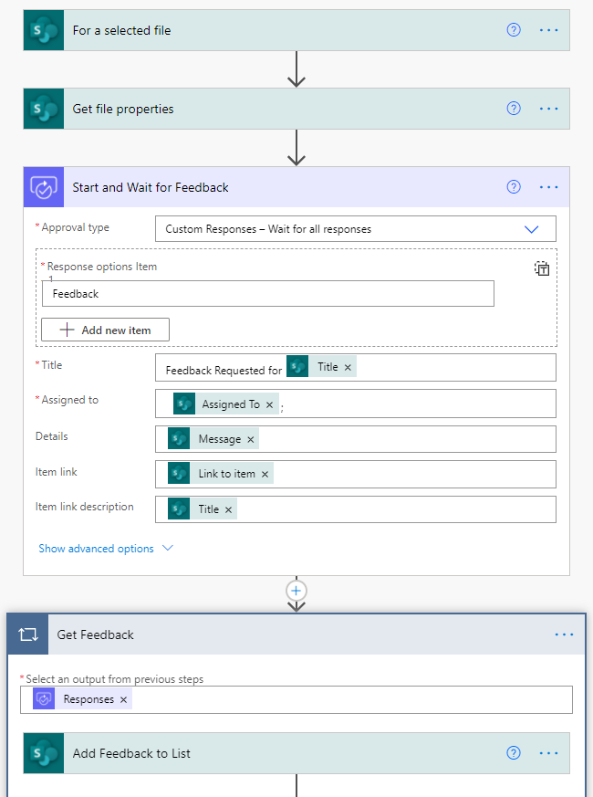
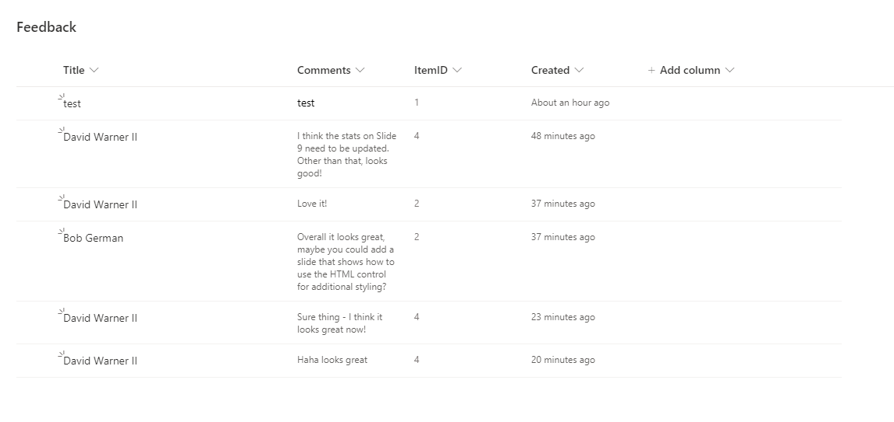
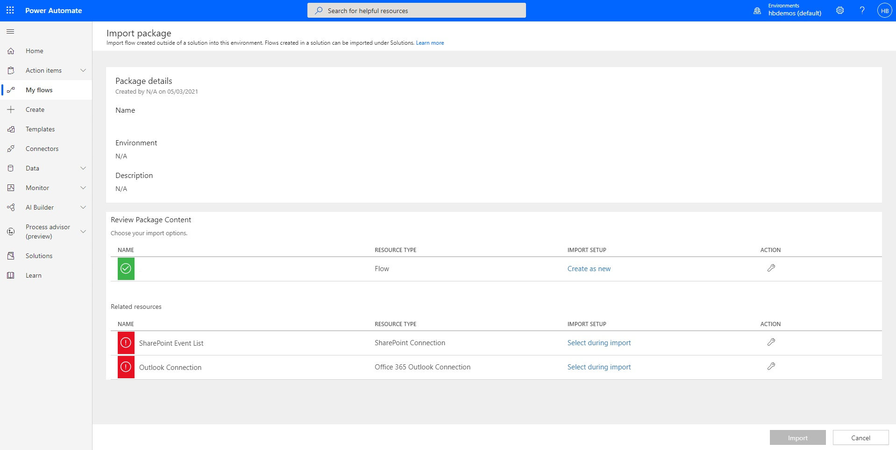
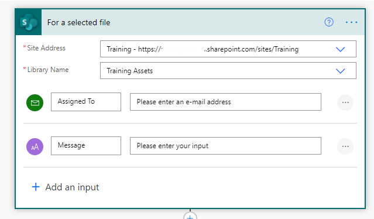
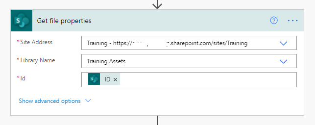
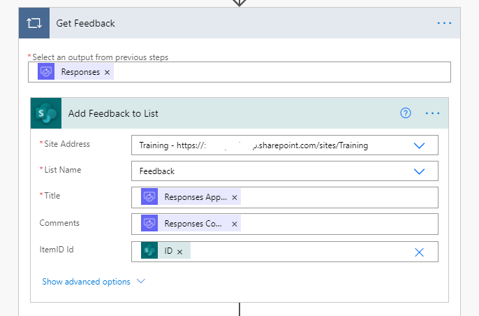

# SharePoint Collect Feedback

## Summary

This sample recreates the SharePoint Collect Feedback Workflow. It will run manually for a selected item in a list and allow you to specify the person(s) to receive feedback from and associate a custom message to the request.  The feedback is then tracked in a separate Feedback list which you'll need to create.

## Applies to

*   [Microsoft Power Automate](https://docs.microsoft.com/power-automate/)

## Compatibility

## Authors

| Solution | Author(s) |
| --- | --- |
| sharepoint-collect-feedback | [April Dunnam](https://github.com/aprildunnam) ([@aprildunnam](https://www.twitter.com/aprildunnam) )

## Version history

| Version | Date | Comments |
| --- | --- | --- |
| 1.0 | July 6, 2021 | Initial release |

## Features

This sample demonstrates the following concepts:

*   Executing a Flow from a SharePoint Library with input parameters
*   Leveraging the custom responses option in Power Automate approvals

## Minimal Path to Awesome

### Create SharePoint List

Before you can use this sample flow, you'll need to create a SharePoint list to hold the feedback that is collected.

In SharePoint, create a list which contains the following columns:

| Name | Type |Required
|---|---|---|
|Title|Single line of text|Yes
|Comments|Multiple lines of text|Yes
|ItemID|Lookup to ID field of the list you want to collect feedback from | Yes

The feedback list will look like this:
  

### Import Solution

1.   Download the solution found under the `solution` folder here: [Collect Feedback Zip](./solution/SharePointCollectFeedback)
1.   Import the Flow Solution. Open  [https://make.powerautomate.com/](https://make.powerautomate.com/). Open **My Flows**, **Import**.
1.   Browse to the file you downloaded and select **Upload**.
1.   In the **Import package** screen, select the **SharePoint Event List**, under **Related Resources** and use the **Select during import** to select an existing connection or create a new SharePoint connection.
     
1.   For the **Outlook Connection**, under **Related Resources** and use the **Select during import** to select an existing connection or create a new Office 365 Outlook Connection.
1.   Once complete, select **Import**.

### Configure Flow

1. Once the solution is imported, edit it
1. Select the **For Selected File** trigger and replace the **Site Address** and the **List Name** to point to your SharePoint site and the source library name that you want to collect feedback from.
   
1. Select the **Get file properties** action and replace the **Site Address** and the **List Name** to point to your SharePoint site and the source library name that you want to collect feedback from.
   
1. Select the **Add Feedback to List** action and replace the **Site Address** and the **List Name** to point to your SharePoint site and the Feedback list name.
   
1. Save your flow and add a new event to your **Events** list to test

## Video Tutorial

If you'd like to see a video tutorial of how this works and how to set it up you can do that here: 

[Power Automate Collect Feedback Workflow for SharePoint Video Tutorial](https://youtu.be/HwVsFMududM).

## Additional Features

You also have the option to utilize SharePoint Column Formatting to create a hyperlink that takes you directly to a filtered view of the feedback for that item.  To do that, create a Single Line of Text field in your list with no data and click on the dropdown - Column Settings - Format this Column - Advanced Mode. 

You will paste in the JSON stored in this file: [Feedback Column Formatting JSON](./solution/ColumnFormatting.json).

## Disclaimer

**THIS CODE IS PROVIDED** _**AS IS**_ **WITHOUT WARRANTY OF ANY KIND, EITHER EXPRESS OR IMPLIED, INCLUDING ANY IMPLIED WARRANTIES OF FITNESS FOR A PARTICULAR PURPOSE, MERCHANTABILITY, OR NON-INFRINGEMENT.**

## Help

We do not support samples, but we this community is always willing to help, and we want to improve these samples. We use GitHub to track issues, which makes it easy for  community members to volunteer their time and help resolve issues.

If you encounter any issues while using this sample, [create a new issue](https://github.com/pnp/powerautomate-samples/issues/new?assignees=&labels=Needs%3A+Triage+%3Amag%3A%2Ctype%3Abug-suspected&template=bug-report.yml&sample=YOURSAMPLENAME&authors=@LinkeD365&title=YOURSAMPLENAME%20-%20).

For questions regarding this sample, [create a new question](https://github.com/pnp/powerautomate-samples/issues/new?assignees=&labels=Needs%3A+Triage+%3Amag%3A%2Ctype%3Abug-suspected&template=question.yml&sample=YOURSAMPLENAME&authors=@LinkeD365&title=YOURSAMPLENAME%20-%20).

Finally, if you have an idea for improvement, [make a suggestion](https://github.com/pnp/powerautomate-samples/issues/new?assignees=&labels=Needs%3A+Triage+%3Amag%3A%2Ctype%3Abug-suspected&template=suggestion.yml&sample=YOURSAMPLENAME&authors=@LinkeD365&title=YOURSAMPLENAME%20-%20).

## For more information

- [Create your first flow](https://docs.microsoft.com/en-us/power-automate/getting-started#create-your-first-flow)
- [Microsoft Power Automate documentation](https://docs.microsoft.com/en-us/power-automate/)

